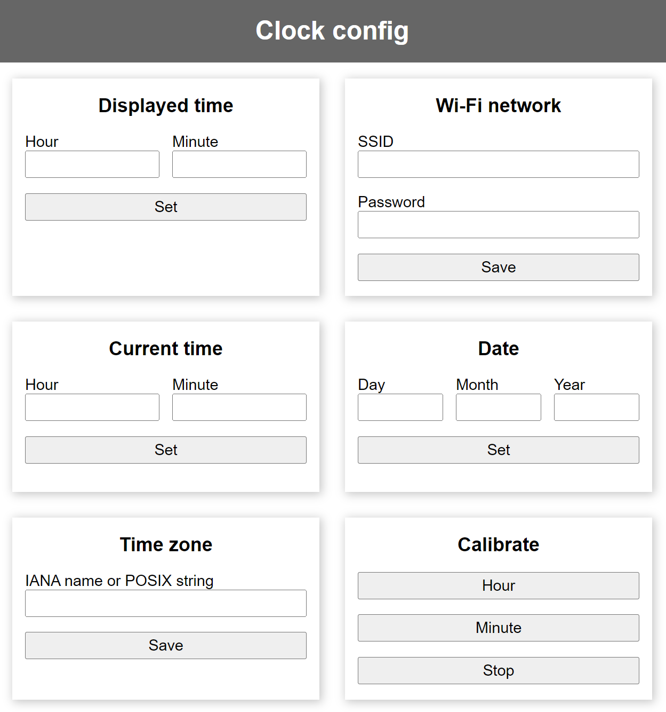

# Rantoge ESP32 

A replacement for the Rantoge motherboard using an ESP32 and DRV8825 stepper drivers.

Thanks to [David Drouin](https://github.com/DMD-Engineering/Rantoge-Clock), without his work I wouldn't have known where to start.

## Pin assignments

The code is intended for use with [this PCB](pcb/README.md).

It expects these GPIO pins to be used:

| Pin| Connection |
| --- | --- |
| 26 | Left button  |
| 23 | Right button |
| 18 | Minutes STEP |
| 19 | Minutes SLEEP |
| 21 | Hours STEP |
| 22 | Hours SLEEP |

Buttons are active low (connected to ground when pressed).

I've used one of [these boards](https://www.aliexpress.com/item/1005006661851122.html). It has the advantage that you can easily get protoboard shields [like this](https://www.aliexpress.com/item/32870622223.html) to make the connections to the PCB, but any ESP32 board should work.

It expects the DRV8825s to be configured for 1/32 microstepping (otherwise, change `MICROSTEPPING_MULTIPLIER`).

## Build settings
Features can be enabled and disabled in `settings.h` to avoid installing libraries which you'll never use, and to reduce the compiled size.

- `#define ENABLE_WIFI 0` to remove the web interface and stop connecting to wifi
- `#define ENABLE_SNTP 0` to disable SNTP time syncing without disabling wifi completely
- `#define ENABLE_BUTTONS 0` to remove all button handling
- `#define ENABLE_OTA 0` to disable the ElegantOTA update page

With OTA enabled, new firmware can be uploaded to http://clock.local/update 

PIN mapping and stepper parameters can also be set.
- `#define MICROSTEPPING_MULTIPLIER 32` indicates that the stepper drivers are set for 1/32 microstepping.
- `#define STEP_INTERVAL 15` waits 15 microseconds after each loop of the stepping code. Lower numbers move the digits faster.

## Libraries
- ESPAsyncWebServer (for ENABLE_WIFI)
- AsyncTCP (for ENABLE_WIFI)
- ESPAsyncButton (for ENABLE_BUTTONS)
- AsyncElegantOTA (for ENABLE_OTA)

## Configuration

### Internet-connected
- If no wi-fi credentials have been set, the clock will create its own `clock` network. Connect to it and go to http://clock.local/ to see the config page.
- Enter your network's SSID and password, and the clock will connect to it. The credentials are stored, and the clock will reconnect after resetting.
- The clock will request the current time from `pool.ntp.org`, and try to determine your time zone from its IP address using [ip-api.com](https://ip-api.com/).
- After a reset, the clock assumes that it is displaying the correct time. If it is not, you can enter the displayed time on the config page to correct it.

### Wi-fi but no internet
- If you don't have a wi-fi network available for the clock to connect to the internet, you can set the current time and time zone though the config page.
- The ESP32 uses [POSIX time zone strings](https://github.com/nayarsystems/posix_tz_db/blob/master/zones.csv). The firmware also understands tzdata time zone names, which it converts to a POSIX equivalent. 

### Buttons
- The left and right buttons control hours and minutes:
	- Single click to increment, double click to decrement (minutes will skip the next advance, rather than advancing 59 times).
	- Long press to calibrate. The motor will step slowly until the button is released.
- Triple click the left button to toggle demo mode. The clock will cycle through advancing hour, then both, then minute.
- Triple click the right button to set the displayed and current minute.
	- The clock will advance through the minutes automatically.
	- Single click the right button when it is advancing towards 00.
	- Double click the right button when it is advancing towards the current minute (as it was when the process started).
	- If the current time has been set from another source (SNTP or the config page), you only need to identify either the current minute or 00. The clock assumes that the current time is set correctly, and only needs to determine the displayed minute.
	- If the current time has not been set, or was set using this process, then you need to identify both the current minute and 00 to allow the clock to idenify the current and displayed minutes.
- (There is no need for an equivalent process for hours - the clock doesn't need to know what hour it is displaying.)

## Things to do
- Toggle demo mode through config page
- If displayed time is fast by one hour and current minute is after 50, wait for the current time to catch up rather than advancing by 23 hours.
- Support 12 hour cams
- Support 12 hour display with 24 hour cams
- Get current time from GPS with a Neo 6M module *(it's just so easy to add silly things to your AliExpress order)*
- Get current time from radio time signals - DCF77, MSF, WWVB *(...it's really really easy to add things to your order)*