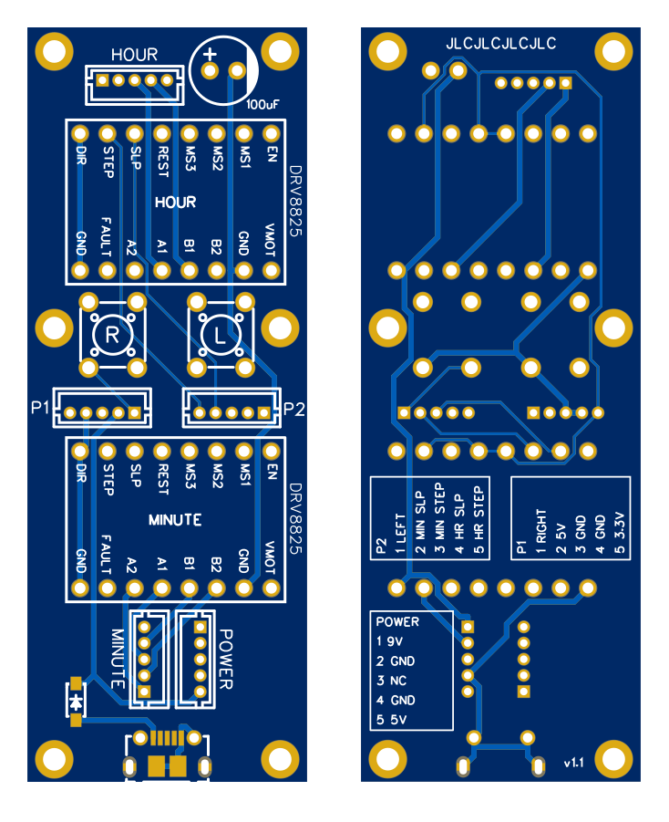

# Rantoge Replacement PCB

- [Schematic](schematic.pdf)
- [Gerber](Gerber_Rantoge.zip)

## Parts
- 2 &times; DRV8825 "stepstick" module
- 2 &times; 6mmx6mm push button switch
- 5 &times; JST B5B-ZR (LF)(SN) 5-pin ZH series connectors
- MT3608 step up power supply module
- 100 uF capacitor
- Molex 1050170001 micro USB port
- B5819W SOD-123 Schottky diode

## Pinouts

### HOUR, MINUTE
To stepper motors

### POWER
To MT3608 power supply module

|Pin|Connection|
|---|----------|
|1|9V (VOUT+)|
|2|GND (VOUT-)|
|3|not connected|
|4|GND (VIN-)|
|5|5V (VIN+)|

### P1
To microcontroller

|Pin|Connection|
|---|----------|
|1|Left button|
|2|Minute SLEEP|
|3|Minute STEP|
|4|Hour SLEEP|
|5|Hour STEP|

### P2
To microcontroller

|Pin|Connection|
|---|----------|
|1|Right button|
|2|5V (see below)|
|3|GND|
|4|GND|
|5|3.3V  in|

The board can be powered by providing 5V to pin 3.

Alternatively, it can be powered from the USB port and it will provide 5V on pin 3 to power the microcontroller.